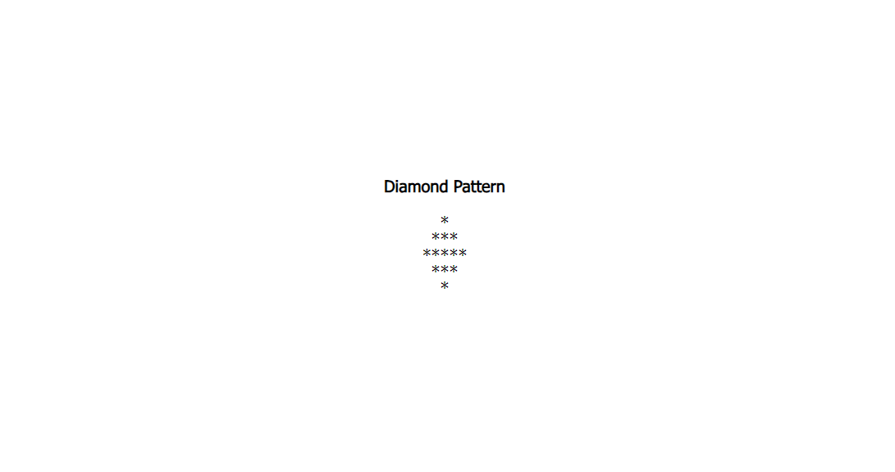

# Tutorial 02
## Make the diamond pattern and check Validation.

## Folder Structure

```
.
├── ccs/
│   ├── reset.css
│   └── style.css
├── demo/
│   └── Tuto_02.png
├── index.php
└── README.md
```


