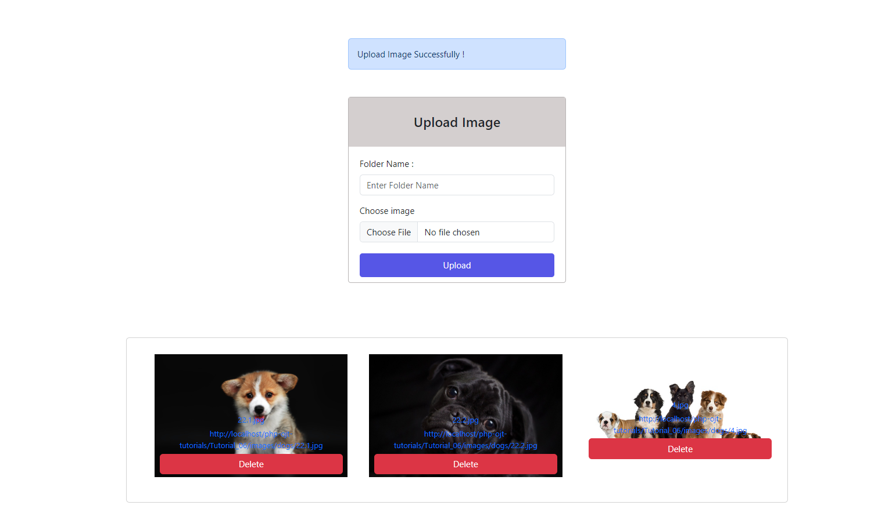

# Tutorial 06

## Create an image upload form and save the images to display

## Folder Structure

```
css/
├── reset.css
└── style.css
images/
├── created_folder_1/
│   ├── a.png
│   └── b.png
└── created_folder_2/
├── └── c.png
└── ...
upload.php
index.php
```

## Validation Rules

- Folder name field is required
- Image field is required
- Image File extesion must be (JPG,PNG,JPEG)
- Image File size must be less than 2000


