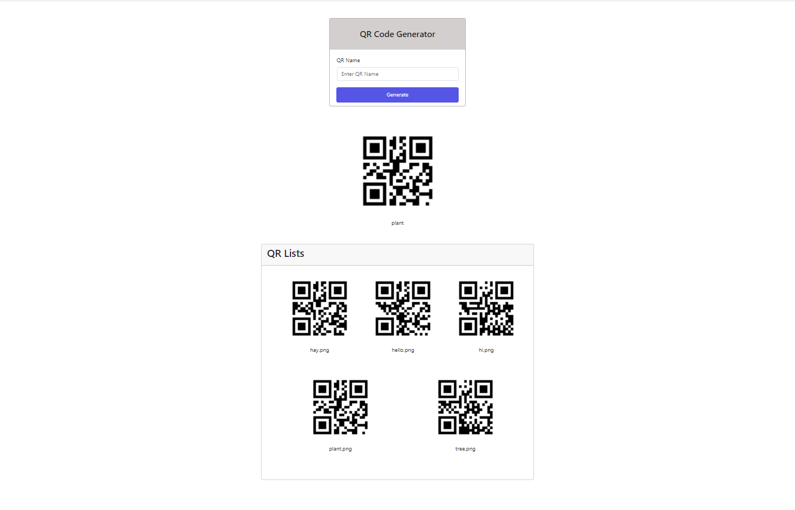

# Tutorial 07

## Create a QR code generate form and save QR code images. Then display the QR code images again.

## Folder Structure
```
.
css/
├── reset.css
└── style.css
demo/
└── Tuto_07.png
images/
├── qr1.png
├── qr2.png
└── ...
libs/
index.php
generate.php
README.md
```

## Validation Rules
- required
- QR name field is required


