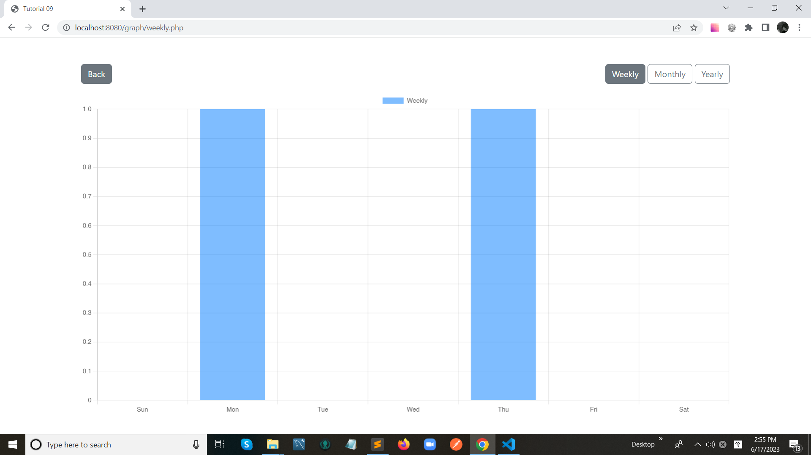

# Tutorial 09

## Show post data with weekly, monthly, yearly graph.

## Folder Structure

```
css/
├── reset.css
└── style.css
demo/
└── Tuto_09.png
graph/
└── weekly.php
└── yearly.php
└── monthly.php
js/
└── script.js
libs/
seeder.php
index.php
README.md
```

## Index Page Design


<hr>

## Weekly Graph Design



<hr>

## Montly Graph Design


<hr>

## Yearly Graph Design


