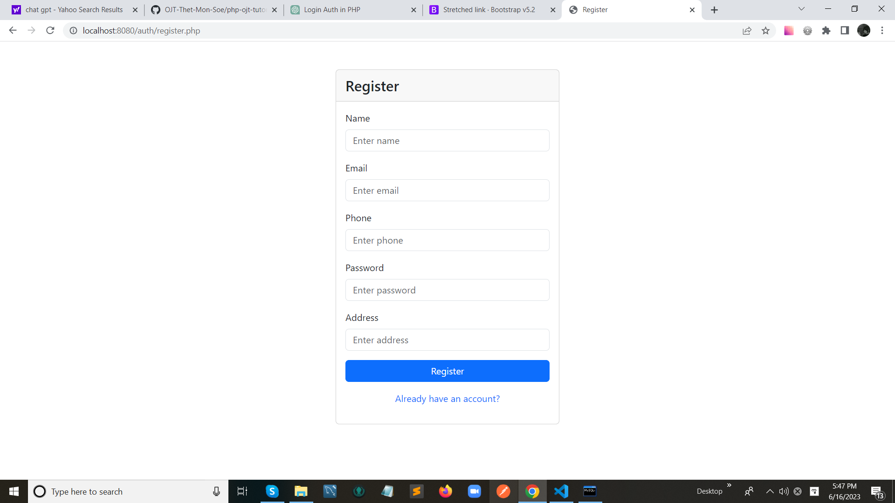
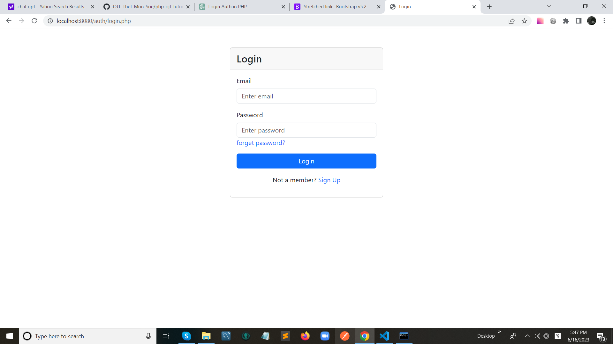
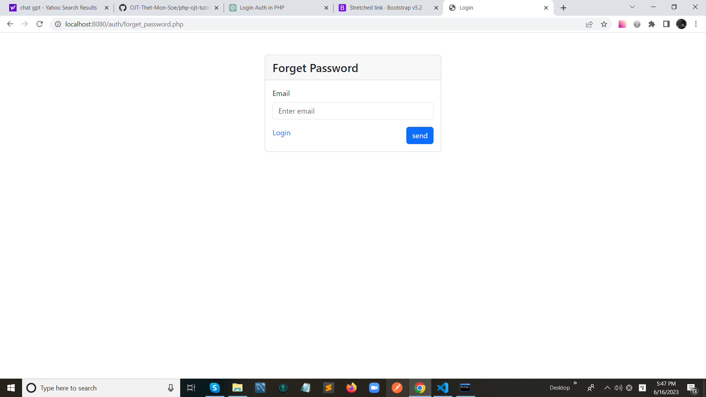
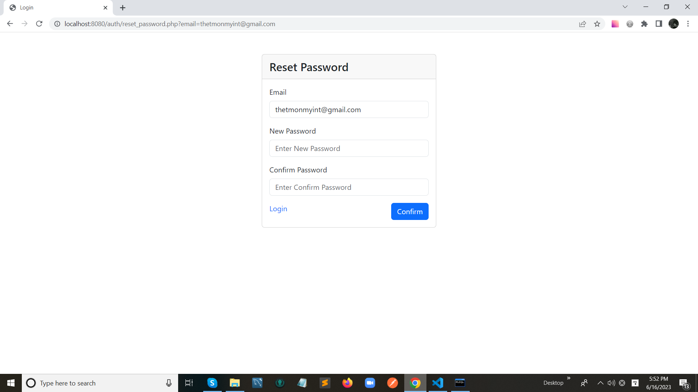
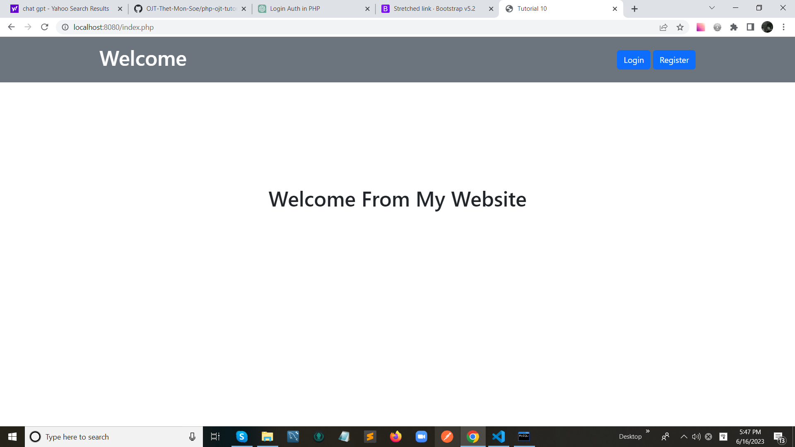
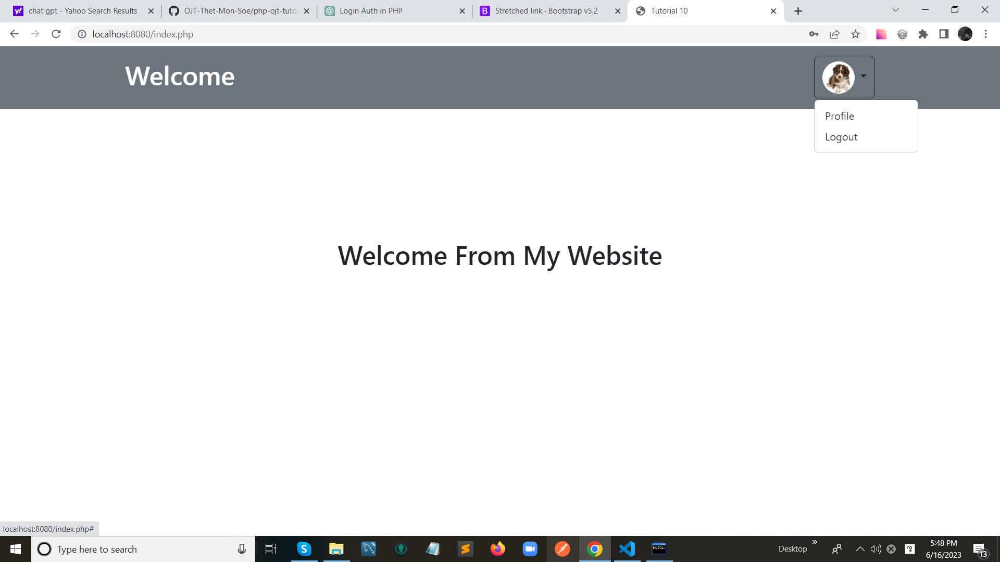
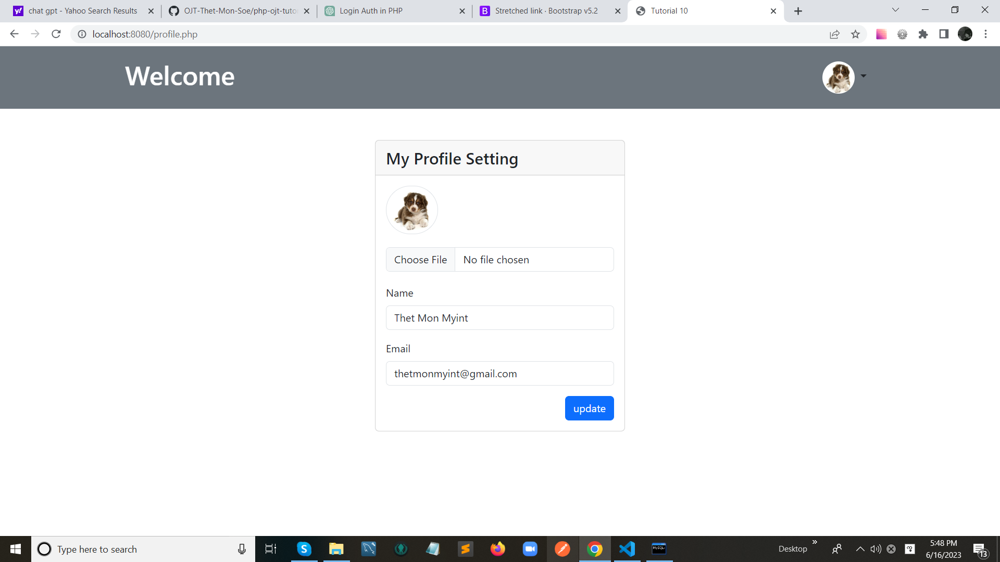

# Tutorial 10

## User Authentication And Middleware (Register,Login,Logout,Forget Password,Reset Password,Middleware)

## Table

users

- id (unsigned int, auto increment, primary key)
- name (varchar, length:255 , Not Null)
- email (varchar, length:255 , Not Null, Unique)
- password (varchar, length:255, Not Null)
- phone (varchar, length:255, Not Null)
- img (varchar, length:255, nullable)
- address (text, Not Null)
- created_datetime (timestamp, default value: current timestamp)
- updated_datetime (timestamp, default value: current timestamp)

## Folder Structure

```
.
auth/
└── forget_password.php
└── login.php
└── register.php
└── reset_password.php
css/
├── reset.css
└── style.css
demo/
└── Tuto_10.png
images/
├── example_01.png
├── example_02.png
└── ...
js/
└── script.js
libs/
index.php
profile.php
README.md
```

<hr>

## Register Page Design



## Login Page Design



## Forget Password Page Design



## Reset Password Page Design



## Home Page Design Without Auth



## Home Page Design With Auth



## Profile Page Design


